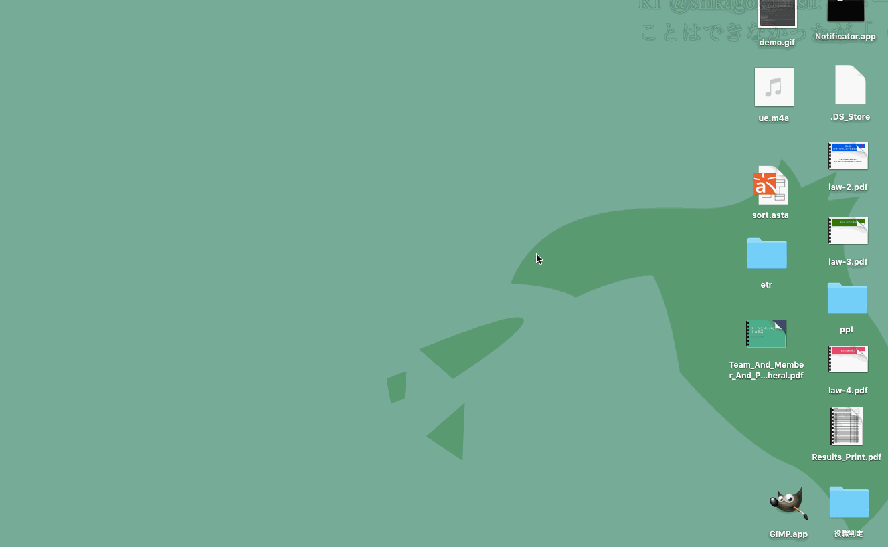

# seiryuu

[](https://circleci.com/gh/MaxMEllon/seiryuu/tree/master)

## About

"seiryuu" is a timeline watcher of twitter like comment in nicovideo.



## Installation

> TODO

## For development

```command
$ git clone https://github.com/MaxMEllon/seiryuu.git && cd seiryuu
$ yarn i
$ yarn run dev
# Access to http://localhost:3000 or execute to `$(npm bin)/electron .`
```

## Dependencies

##### global dependencies

- **node** `>=` *8.0.0*
- **yarn** `>=` *0.24.5*

## How to use

> TODO

## LICENSE

**Copyright (c) 2017 "MaxMEllon" Kento TSUJI**

Licensed under the [MIT license](./LICENSE.txt)

  <p align="right"><a href="#top">:arrow_heading_up:</a></p>
